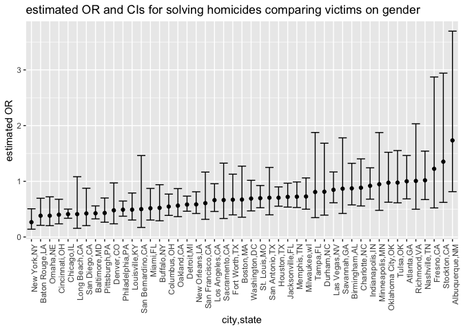
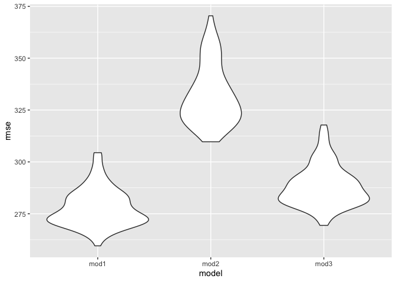

p8105_hw6_jd3924
================
Jiahe Deng
2022-12-01

``` r
library(tidyverse)
```

    ## ── Attaching packages ─────────────────────────────────────── tidyverse 1.3.2 ──
    ## ✔ ggplot2 3.3.6      ✔ purrr   0.3.5 
    ## ✔ tibble  3.1.8      ✔ dplyr   1.0.10
    ## ✔ tidyr   1.2.1      ✔ stringr 1.4.1 
    ## ✔ readr   2.1.3      ✔ forcats 0.5.2 
    ## ── Conflicts ────────────────────────────────────────── tidyverse_conflicts() ──
    ## ✖ dplyr::filter() masks stats::filter()
    ## ✖ dplyr::lag()    masks stats::lag()

``` r
library(dplyr)
library(readr)
library(mgcv)
```

    ## 载入需要的程辑包：nlme
    ## 
    ## 载入程辑包：'nlme'
    ## 
    ## The following object is masked from 'package:dplyr':
    ## 
    ##     collapse
    ## 
    ## This is mgcv 1.8-40. For overview type 'help("mgcv-package")'.

``` r
library(modelr)
```

Question2

``` r
homicides_data = 
  read_csv("homicide-data.csv", na =" ") %>%
  drop_na() %>%
  mutate(
    city_state = str_c(city,state, sep = ","),
    victim_age = as.numeric(victim_age),
    resolved = ifelse(disposition %in% c("Closed without arrest","Open/No arrest"), "unsolved","solved")) %>%
  filter(victim_race %in% c("White", "Black"),
         !city_state %in% c("Tulsa,AL","Dallas,TX","Phoenix,AZ","Kansas City,MO"),
         victim_age != "Unknown")
```

    ## Warning: One or more parsing issues, call `problems()` on your data frame for details,
    ## e.g.:
    ##   dat <- vroom(...)
    ##   problems(dat)

    ## Rows: 52179 Columns: 12
    ## ── Column specification ────────────────────────────────────────────────────────
    ## Delimiter: ","
    ## chr (9): uid, victim_last, victim_first, victim_race, victim_age, victim_sex...
    ## dbl (3): reported_date, lat, lon
    ## 
    ## ℹ Use `spec()` to retrieve the full column specification for this data.
    ## ℹ Specify the column types or set `show_col_types = FALSE` to quiet this message.

    ## Warning in mask$eval_all_mutate(quo): 强制改变过程中产生了NA

``` r
homicides_data
```

    ## # A tibble: 39,361 × 14
    ##    uid   repor…¹ victi…² victi…³ victi…⁴ victi…⁵ victi…⁶ city  state   lat   lon
    ##    <chr>   <dbl> <chr>   <chr>   <chr>     <dbl> <chr>   <chr> <chr> <dbl> <dbl>
    ##  1 Alb-…  2.01e7 SATTER… VIVIANA White        15 Female  Albu… NM     35.1 -107.
    ##  2 Alb-…  2.01e7 MULA    VIVIAN  White        72 Female  Albu… NM     35.1 -107.
    ##  3 Alb-…  2.01e7 BOOK    GERALD… White        91 Female  Albu… NM     35.2 -107.
    ##  4 Alb-…  2.01e7 MARTIN… GUSTAVO White        56 Male    Albu… NM     35.1 -107.
    ##  5 Alb-…  2.01e7 GRAY    STEFAN… White        43 Female  Albu… NM     35.1 -107.
    ##  6 Alb-…  2.01e7 BRITO   ELIZAB… White        22 Female  Albu… NM     35.1 -107.
    ##  7 Alb-…  2.01e7 KING    TEVION  Black        15 Male    Albu… NM     35.1 -107.
    ##  8 Alb-…  2.01e7 BOYKIN  CEDRIC  Black        25 Male    Albu… NM     35.1 -107.
    ##  9 Alb-…  2.01e7 BARRAG… MIGUEL  White        20 Male    Albu… NM     35.1 -107.
    ## 10 Alb-…  2.01e7 WRONSKI VIOLA   White        88 Female  Albu… NM     35.1 -107.
    ## # … with 39,351 more rows, 3 more variables: disposition <chr>,
    ## #   city_state <chr>, resolved <chr>, and abbreviated variable names
    ## #   ¹​reported_date, ²​victim_last, ³​victim_first, ⁴​victim_race, ⁵​victim_age,
    ## #   ⁶​victim_sex

``` r
baltimore_df = 
  homicides_data %>%
  filter(city_state == "Baltimore,MD")
baltimore_df
```

    ## # A tibble: 2,753 × 14
    ##    uid   repor…¹ victi…² victi…³ victi…⁴ victi…⁵ victi…⁶ city  state   lat   lon
    ##    <chr>   <dbl> <chr>   <chr>   <chr>     <dbl> <chr>   <chr> <chr> <dbl> <dbl>
    ##  1 Bal-…  2.01e7 NELSON  LEON    Black        17 Male    Balt… MD     39.3 -76.7
    ##  2 Bal-…  2.01e7 GOLF    EDDIE   Black        26 Male    Balt… MD     39.3 -76.7
    ##  3 Bal-…  2.01e7 MACKEN… THOMAS… Black        21 Male    Balt… MD     39.4 -76.6
    ##  4 Bal-…  2.01e7 CANUPP  EDWARD… White        61 Male    Balt… MD     39.2 -76.6
    ##  5 Bal-…  2.01e7 CUNNIN… MICHAEL Black        46 Male    Balt… MD     39.4 -76.6
    ##  6 Bal-…  2.01e7 ALSTON  RAY WI… Black        27 Male    Balt… MD     39.3 -76.6
    ##  7 Bal-…  2.01e7 HENDER… YULE A… Black        21 Male    Balt… MD     39.3 -76.6
    ##  8 Bal-…  2.01e7 MCDOWE… MARCU   Black        16 Male    Balt… MD     39.3 -76.6
    ##  9 Bal-…  2.01e7 GARDNER RODNEY… Black        21 Male    Balt… MD     39.3 -76.6
    ## 10 Bal-…  2.01e7 BURNET… NELSENE Black        44 Female  Balt… MD     39.3 -76.7
    ## # … with 2,743 more rows, 3 more variables: disposition <chr>,
    ## #   city_state <chr>, resolved <chr>, and abbreviated variable names
    ## #   ¹​reported_date, ²​victim_last, ³​victim_first, ⁴​victim_race, ⁵​victim_age,
    ## #   ⁶​victim_sex

``` r
fit_logistic = 
  baltimore_df %>% 
  mutate(resolved = ifelse(resolved == "solved", 1, 0)) %>%
  glm(resolved ~ victim_age + victim_sex + victim_race, data = ., family = binomial())

fit_logistic %>% 
  broom::tidy() %>% 
  mutate(OR = exp(estimate),
         lower = exp(estimate - 1.96 * std.error),
         upper = exp(estimate + 1.96 * std.error)) %>%
  select(term, estimate, OR, lower, upper, p.value) %>%
  knitr::kable(digits = 3)
```

| term             | estimate |    OR | lower | upper | p.value |
|:-----------------|---------:|------:|------:|------:|--------:|
| (Intercept)      |    0.310 | 1.363 | 0.975 | 1.907 |   0.070 |
| victim_age       |   -0.007 | 0.993 | 0.987 | 1.000 |   0.043 |
| victim_sexMale   |   -0.854 | 0.426 | 0.325 | 0.558 |   0.000 |
| victim_raceWhite |    0.842 | 2.320 | 1.648 | 3.268 |   0.000 |

``` r
glm_cities = 
  homicides_data %>%
  mutate(
      resolved = ifelse(resolved == "solved", 1, 0)
  ) %>%
  nest(data = -city_state) %>%
  mutate(
    models = map(data, ~glm(resolved ~ victim_age + victim_race + victim_sex, data = .x, family = binomial())),
  results = map(models, broom::tidy)) %>% 
  select(-data, -models) %>% 
  unnest(results)

glm_cities = 
  glm_cities %>% 
  mutate(OR = exp(estimate),
         lower = exp(estimate - 1.96 * std.error),
         upper = exp(estimate + 1.96 * std.error)) %>%
  select(city_state, term, estimate, OR, lower, upper, p.value)
glm_cities
```

    ## # A tibble: 193 × 7
    ##    city_state     term                 estimate         OR lower   upper p.value
    ##    <chr>          <chr>                   <dbl>      <dbl> <dbl>   <dbl>   <dbl>
    ##  1 Albuquerque,NM (Intercept)         0.647        1.91e+0 0.551   6.62  3.07e-1
    ##  2 Albuquerque,NM victim_age         -0.0201       9.80e-1 0.963   0.998 2.71e-2
    ##  3 Albuquerque,NM victim_raceWhite    0.396        1.49e+0 0.656   3.36  3.42e-1
    ##  4 Albuquerque,NM victim_sexMale      0.550        1.73e+0 0.814   3.70  1.54e-1
    ##  5 Albuquerque,NM victim_sexUnknown -14.6          4.61e-7 0     Inf     9.87e-1
    ##  6 Atlanta,GA     (Intercept)         0.869        2.39e+0 1.49    3.83  3.21e-4
    ##  7 Atlanta,GA     victim_age         -0.0116       9.88e-1 0.979   0.997 1.24e-2
    ##  8 Atlanta,GA     victim_raceWhite    0.269        1.31e+0 0.749   2.28  3.45e-1
    ##  9 Atlanta,GA     victim_sexMale      0.0000771    1.00e+0 0.684   1.46  1.00e+0
    ## 10 Baltimore,MD   (Intercept)         0.310        1.36e+0 0.975   1.91  7.04e-2
    ## # … with 183 more rows

``` r
male_vs_female = 
  glm_cities %>%
  filter(term == "victim_sexMale") %>%
  mutate(city_state = fct_reorder(city_state, OR)) %>%
  ggplot(aes(x = city_state, y = OR)) +
  geom_point() + 
  geom_errorbar(aes(ymin = lower, ymax = upper)) + 
  theme(axis.text.x = element_text(angle = 90, hjust = 1)) +
  labs(
    x = "city,state",
    y = "estimated OR",
    title = "estimated OR and CIs for solving homicides comparing victims on gender"
  )
male_vs_female
```

<!-- -->
when all other variables fixed, homicides with male victims are
relatively less likely to be resolved than homicides with female victims
in all cities.And city Albuquerque,NM has the highest odd ratio. And New
York has the lowest odd ratio, also it confidence interval does not
contain 1.

Question3

``` r
birthweight = 
  read_csv("birthweight.csv") %>%
  janitor::clean_names() %>%
  drop_na() %>%
  mutate(
    babysex = as.factor(babysex),
    frace = as.factor(frace),
    malform = as.factor(malform),
    mrace = as.factor(mrace))
```

    ## Rows: 4342 Columns: 20
    ## ── Column specification ────────────────────────────────────────────────────────
    ## Delimiter: ","
    ## dbl (20): babysex, bhead, blength, bwt, delwt, fincome, frace, gaweeks, malf...
    ## 
    ## ℹ Use `spec()` to retrieve the full column specification for this data.
    ## ℹ Specify the column types or set `show_col_types = FALSE` to quiet this message.

``` r
birthweight
```

    ## # A tibble: 4,342 × 20
    ##    babysex bhead blength   bwt delwt fincome frace gaweeks malform menarche
    ##    <fct>   <dbl>   <dbl> <dbl> <dbl>   <dbl> <fct>   <dbl> <fct>      <dbl>
    ##  1 2          34      51  3629   177      35 1        39.9 0             13
    ##  2 1          34      48  3062   156      65 2        25.9 0             14
    ##  3 2          36      50  3345   148      85 1        39.9 0             12
    ##  4 1          34      52  3062   157      55 1        40   0             14
    ##  5 2          34      52  3374   156       5 1        41.6 0             13
    ##  6 1          33      52  3374   129      55 1        40.7 0             12
    ##  7 2          33      46  2523   126      96 2        40.3 0             14
    ##  8 2          33      49  2778   140       5 1        37.4 0             12
    ##  9 1          36      52  3515   146      85 1        40.3 0             11
    ## 10 1          33      50  3459   169      75 2        40.7 0             12
    ## # … with 4,332 more rows, and 10 more variables: mheight <dbl>, momage <dbl>,
    ## #   mrace <fct>, parity <dbl>, pnumlbw <dbl>, pnumsga <dbl>, ppbmi <dbl>,
    ## #   ppwt <dbl>, smoken <dbl>, wtgain <dbl>

``` r
map(birthweight, ~ sum(is.na(.)))
```

    ## $babysex
    ## [1] 0
    ## 
    ## $bhead
    ## [1] 0
    ## 
    ## $blength
    ## [1] 0
    ## 
    ## $bwt
    ## [1] 0
    ## 
    ## $delwt
    ## [1] 0
    ## 
    ## $fincome
    ## [1] 0
    ## 
    ## $frace
    ## [1] 0
    ## 
    ## $gaweeks
    ## [1] 0
    ## 
    ## $malform
    ## [1] 0
    ## 
    ## $menarche
    ## [1] 0
    ## 
    ## $mheight
    ## [1] 0
    ## 
    ## $momage
    ## [1] 0
    ## 
    ## $mrace
    ## [1] 0
    ## 
    ## $parity
    ## [1] 0
    ## 
    ## $pnumlbw
    ## [1] 0
    ## 
    ## $pnumsga
    ## [1] 0
    ## 
    ## $ppbmi
    ## [1] 0
    ## 
    ## $ppwt
    ## [1] 0
    ## 
    ## $smoken
    ## [1] 0
    ## 
    ## $wtgain
    ## [1] 0

There is no NA in the dataset.

``` r
model_fit = lm(bwt ~ ., data = birthweight)
summary(model_fit)
```

    ## 
    ## Call:
    ## lm(formula = bwt ~ ., data = birthweight)
    ## 
    ## Residuals:
    ##      Min       1Q   Median       3Q      Max 
    ## -1097.68  -184.86    -3.33   173.09  2344.15 
    ## 
    ## Coefficients: (3 not defined because of singularities)
    ##               Estimate Std. Error t value Pr(>|t|)    
    ## (Intercept) -6265.3914   660.4011  -9.487  < 2e-16 ***
    ## babysex2       28.7073     8.4652   3.391 0.000702 ***
    ## bhead         130.7781     3.4523  37.881  < 2e-16 ***
    ## blength        74.9536     2.0217  37.075  < 2e-16 ***
    ## delwt           4.1007     0.3948  10.386  < 2e-16 ***
    ## fincome         0.2898     0.1795   1.614 0.106551    
    ## frace2         14.3313    46.1501   0.311 0.756168    
    ## frace3         21.2361    69.2960   0.306 0.759273    
    ## frace4        -46.9962    44.6782  -1.052 0.292912    
    ## frace8          4.2969    74.0741   0.058 0.953745    
    ## gaweeks        11.5494     1.4654   7.882 4.06e-15 ***
    ## malform1        9.7650    70.6259   0.138 0.890039    
    ## menarche       -3.5508     2.8951  -1.226 0.220083    
    ## mheight         9.7874    10.3116   0.949 0.342588    
    ## momage          0.7593     1.2221   0.621 0.534418    
    ## mrace2       -151.4354    46.0453  -3.289 0.001014 ** 
    ## mrace3        -91.3866    71.9190  -1.271 0.203908    
    ## mrace4        -56.4787    45.1369  -1.251 0.210901    
    ## parity         95.5411    40.4793   2.360 0.018307 *  
    ## pnumlbw             NA         NA      NA       NA    
    ## pnumsga             NA         NA      NA       NA    
    ## ppbmi           4.3538    14.8913   0.292 0.770017    
    ## ppwt           -3.4716     2.6121  -1.329 0.183913    
    ## smoken         -4.8544     0.5871  -8.269  < 2e-16 ***
    ## wtgain              NA         NA      NA       NA    
    ## ---
    ## Signif. codes:  0 '***' 0.001 '**' 0.01 '*' 0.05 '.' 0.1 ' ' 1
    ## 
    ## Residual standard error: 272.5 on 4320 degrees of freedom
    ## Multiple R-squared:  0.7183, Adjusted R-squared:  0.717 
    ## F-statistic: 524.6 on 21 and 4320 DF,  p-value: < 2.2e-16

Apply lm to all variable in the data, and check their p_value, and
choose only those are significant. Significant variable are babysex2,
bhead, blength, gaweeks, mrace2, parity, and smoken. Then, we need to
test the assumption of linear regresson.

``` r
qqnorm(residuals(model_fit), ylab = "residuals")
qqline(residuals(model_fit))
```

<!-- -->
From the plot above we can see that the residual follow a normal
distribution, which is met the assumpition.

``` r
birthweight %>%
  add_residuals(model_fit) %>%
  add_predictions(model_fit) %>%
  ggplot(aes(x = pred, y = resid)) + geom_point(alpha=0.5) +
  geom_smooth(color = "red", method = "lm") +
  labs(
    x = "fitted value",
    y = "residuals"
  )
```

    ## Warning in predict.lm(model, data): 用秩缺乏拟合来进行预测的结果很可能不可靠

    ## Warning in predict.lm(model, data): 用秩缺乏拟合来进行预测的结果很可能不可靠

    ## `geom_smooth()` using formula 'y ~ x'

<!-- -->
use add_predictions and add_residuals to plot the model residuals
against fitted values. From the plot above, we can see that the
variances is not a constance, which does not meet the assumption. Thus,
we should use glm() instead of lm()

``` r
glm(bwt ~ babysex + bhead + blength + gaweeks + mrace + parity + smoken, data = birthweight) %>%
  broom::tidy() %>% knitr::kable(digits = 3)
```

| term        |  estimate | std.error | statistic | p.value |
|:------------|----------:|----------:|----------:|--------:|
| (Intercept) | -5799.477 |   100.311 |   -57.815 |   0.000 |
| babysex2    |    30.987 |     8.621 |     3.594 |   0.000 |
| bhead       |   135.810 |     3.495 |    38.864 |   0.000 |
| blength     |    78.777 |     2.036 |    38.699 |   0.000 |
| gaweeks     |    12.592 |     1.487 |     8.467 |   0.000 |
| mrace2      |  -138.499 |     9.355 |   -14.804 |   0.000 |
| mrace3      |  -116.597 |    42.943 |    -2.715 |   0.007 |
| mrace4      |  -136.454 |    18.993 |    -7.185 |   0.000 |
| parity      |   100.391 |    41.148 |     2.440 |   0.015 |
| smoken      |    -4.223 |     0.595 |    -7.094 |   0.000 |

``` r
glm(bwt ~ blength + gaweeks, data = birthweight)
```

    ## 
    ## Call:  glm(formula = bwt ~ blength + gaweeks, data = birthweight)
    ## 
    ## Coefficients:
    ## (Intercept)      blength      gaweeks  
    ##    -4347.67       128.56        27.05  
    ## 
    ## Degrees of Freedom: 4341 Total (i.e. Null);  4339 Residual
    ## Null Deviance:       1.139e+09 
    ## Residual Deviance: 481800000     AIC: 62770

``` r
glm(bwt ~ bhead * blength * babysex, data = birthweight)
```

    ## 
    ## Call:  glm(formula = bwt ~ bhead * blength * babysex, data = birthweight)
    ## 
    ## Coefficients:
    ##            (Intercept)                   bhead                 blength  
    ##             -7176.8170                181.7956                102.1269  
    ##               babysex2           bhead:blength          bhead:babysex2  
    ##              6374.8684                 -0.5536               -198.3932  
    ##       blength:babysex2  bhead:blength:babysex2  
    ##              -123.7729                  3.8781  
    ## 
    ## Degrees of Freedom: 4341 Total (i.e. Null);  4334 Residual
    ## Null Deviance:       1.139e+09 
    ## Residual Deviance: 358800000     AIC: 61500

``` r
cv_df = 
  crossv_mc(birthweight, 100) %>% 
   mutate(
    train = map(train, as_tibble),
    test = map(test, as_tibble))
cv_df
```

    ## # A tibble: 100 × 3
    ##    train                 test                .id  
    ##    <list>                <list>              <chr>
    ##  1 <tibble [3,473 × 20]> <tibble [869 × 20]> 001  
    ##  2 <tibble [3,473 × 20]> <tibble [869 × 20]> 002  
    ##  3 <tibble [3,473 × 20]> <tibble [869 × 20]> 003  
    ##  4 <tibble [3,473 × 20]> <tibble [869 × 20]> 004  
    ##  5 <tibble [3,473 × 20]> <tibble [869 × 20]> 005  
    ##  6 <tibble [3,473 × 20]> <tibble [869 × 20]> 006  
    ##  7 <tibble [3,473 × 20]> <tibble [869 × 20]> 007  
    ##  8 <tibble [3,473 × 20]> <tibble [869 × 20]> 008  
    ##  9 <tibble [3,473 × 20]> <tibble [869 × 20]> 009  
    ## 10 <tibble [3,473 × 20]> <tibble [869 × 20]> 010  
    ## # … with 90 more rows

``` r
cv_df = 
  cv_df %>% 
  mutate(
    mod1 = map(train, ~glm(bwt ~ babysex + bhead + blength + gaweeks + mrace + parity + smoken, data = .x)),
    mod2 = map(train, ~glm(bwt ~ blength + gaweeks, data = .x)),
    mod3 = map(train, ~glm(bwt ~ bhead * blength * babysex, data =.x))) %>%
  mutate(
    rmse_mod1 = map2_dbl(.x=mod1, .y=test, ~rmse(model = .x, data = .y)),
    rmse_mod2 = map2_dbl(.x=mod2, .y=test, ~rmse(model = .x, data = .y)),
    rmse_mod3 = map2_dbl(.x=mod3, .y=test, ~rmse(model = .x, data = .y)))
cv_df
```

    ## # A tibble: 100 × 9
    ##    train    test                .id   mod1   mod2  mod3  rmse_…¹ rmse_…² rmse_…³
    ##    <list>   <list>              <chr> <list> <lis> <lis>   <dbl>   <dbl>   <dbl>
    ##  1 <tibble> <tibble [869 × 20]> 001   <glm>  <glm> <glm>    281.    337.    293.
    ##  2 <tibble> <tibble [869 × 20]> 002   <glm>  <glm> <glm>    273.    327.    279.
    ##  3 <tibble> <tibble [869 × 20]> 003   <glm>  <glm> <glm>    274.    320.    285.
    ##  4 <tibble> <tibble [869 × 20]> 004   <glm>  <glm> <glm>    276.    339.    288.
    ##  5 <tibble> <tibble [869 × 20]> 005   <glm>  <glm> <glm>    275.    313.    283.
    ##  6 <tibble> <tibble [869 × 20]> 006   <glm>  <glm> <glm>    285.    336.    293.
    ##  7 <tibble> <tibble [869 × 20]> 007   <glm>  <glm> <glm>    282.    330.    292.
    ##  8 <tibble> <tibble [869 × 20]> 008   <glm>  <glm> <glm>    271.    342.    287.
    ##  9 <tibble> <tibble [869 × 20]> 009   <glm>  <glm> <glm>    272.    321.    281.
    ## 10 <tibble> <tibble [869 × 20]> 010   <glm>  <glm> <glm>    278.    333.    291.
    ## # … with 90 more rows, and abbreviated variable names ¹​rmse_mod1, ²​rmse_mod2,
    ## #   ³​rmse_mod3

``` r
cv_df %>% 
  select(starts_with("rmse")) %>% 
  pivot_longer(
    everything(),
    names_to = "model", 
    values_to = "rmse",
    names_prefix = "rmse_") %>% 
  mutate(model = fct_inorder(model)) %>% 
  ggplot(aes(x = model, y = rmse)) + geom_violin()
```

<!-- -->
Among these model, mod 1 is the best among these three model because it
has lowest rmse.
